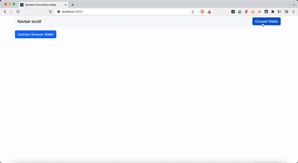

# Concordium Hackathon - TASK 3: Your First Concordium DApp

## My wallet address
- Concordium Address (mainnet): 45GytP6c3bF7CKM6twuEfSHxnYkG3GoLkrLNm72t6o9YHQEmMu 
- USDT Address (Metamask): 0x1557EE78Ab23F7264366a055eCAce48390b5B0C7 
- Task 1: https://github.com/anhfactor/concordium-task1
- Task 2: https://github.com/anhfactor/concordium-task2

## My process in testnet
- Contract name: donation
- Index: 3025
- Demo link: https://concordium-task3.vercel.app/

## Implement frontend
```
cd frontend
npm run build
npm start
```
  
## Demo video

